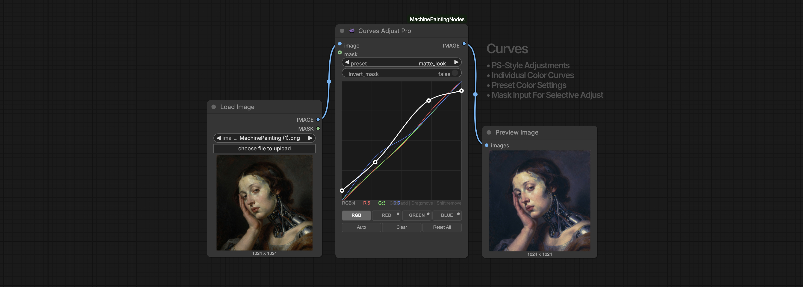
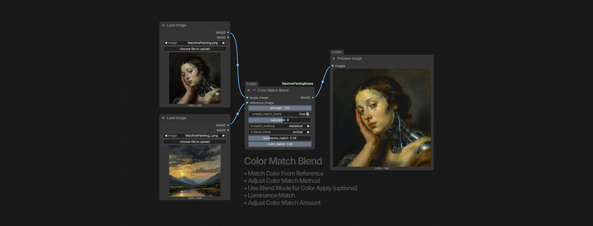
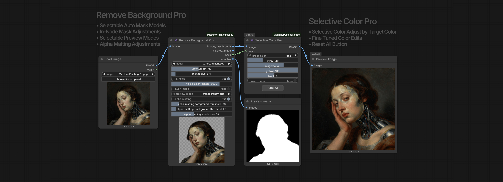
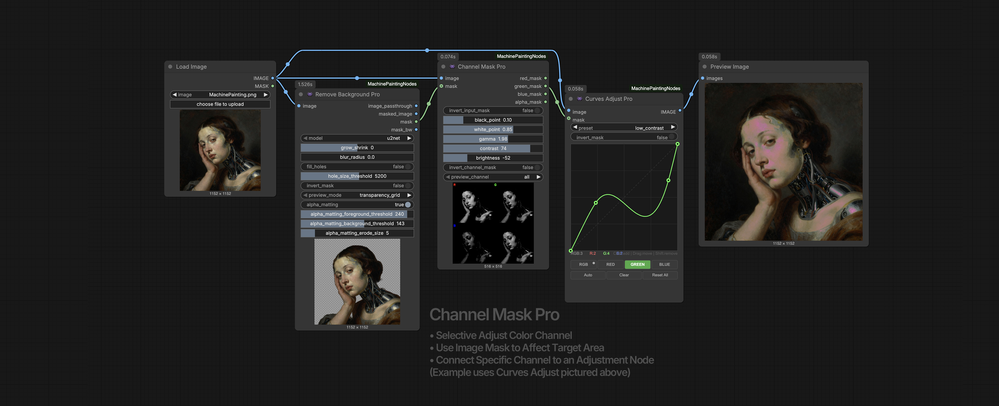
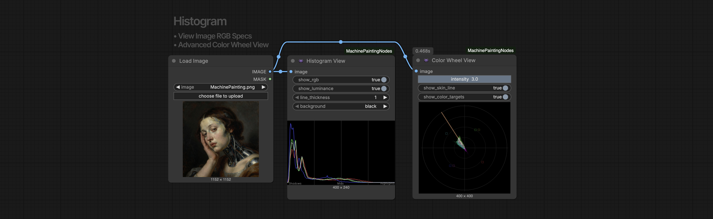
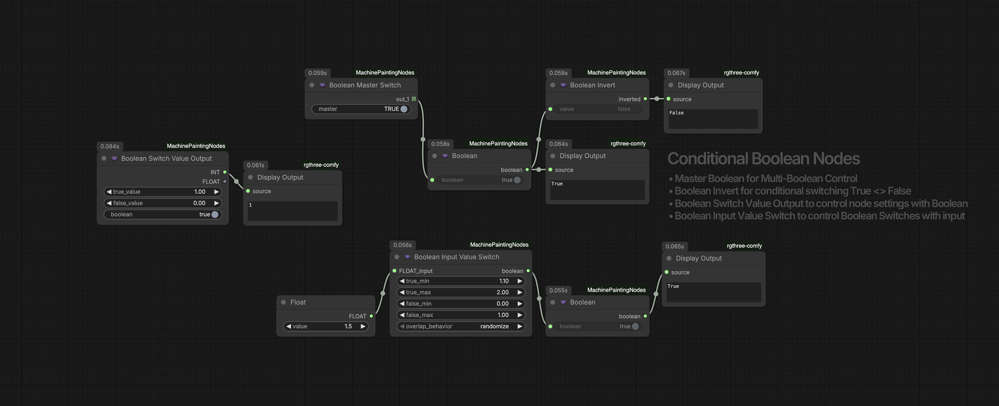

# ComfyUI-MachinePaintingNodes

**Professional Image Editing & Adjustments, Curves, color grading, mask tools, and advanced utilities for your ComfyUI workflows**

A comprehensive node suite for professional level image processing, color correction, and advanced workflow enhancement utilities. 

(All current nodes.)


## Installation

### ComfyUI Manager (Recommended)
Search for "MachinePaintingNodes" in ComfyUI Manager and install.

### Manual Installation
```bash
cd ComfyUI/custom_nodes
git clone https://github.com/machinepainting/ComfyUI-MachinePaintingNodes.git
```

### Dependencies
```bash
pip install -r requirements.txt
```

---

## Nodes (31 Total)

### Color Adjustment

(example)


| Node | Description |
|------|-------------|
| **Curves Adjust Pro** | Interactive Photoshop-style curves with RGB/R/G/B channels, 17 presets, mask support, channel-mask support |
| **Levels Adjust** | Black point, white point, gamma, output levels |
| **Auto Levels** | Automatic levels correction |
| **Selective Color Pro** | CMYK adjustments for specific color ranges and fine tuned color adjustments (reds, yellows, greens, cyans, blues, magentas, whites, neutrals, blacks) |
| **Brightness Contrast Adjust** | Simple brightness and contrast controls with simple slider controls |
| **Color Match Blend** | Match colors from one image to another with multiple methods (statistical, histogram, reinhard), blend modes, and adjustments |
| **Color Adjust Blend** | Color match with blend modes, plus RGB color balance for Shadows, Mid-Range, and Highlights |
| **LUT Apply** | Apply .cube/.3dl LUT files for cinematic color grading (includes 5 bundled LUTs) |

(examples)



### Mask and Background

| Node | Description |
|------|-------------|
| **Remove Background Pro** | Advanced AI-powered background removal with 8 rembg models, mask editing tools, multiple preview modes |
| **Mask Editor** | Stand alone Mask Tools. Refine masks with grow/shrink/blur/fill |
| **Apply Mask** | Composite image with mask and background options |
| **Channel Mask Pro** | Extract R/G/B/A channels as separate masks with levels/contrast adjustments and input mask support for advanced Channel Masking |

(examples)



### Blending

| Node | Description |
|------|-------------|
| **Image Blend Pro** | Blend images with 15 blend modes (normal, overlay, multiply, screen, soft light, hard light, etc.) |

### Analysis

| Node | Description |
|------|-------------|
| **Histogram View** | Display RGB/luminance histogram in-node for advanced image setting color display|
| **Color Wheel View** | Display vectorscope color distribution in-node for advanced image setting color display |

(example)


### Utilities

| Node | Description |
|------|-------------|
| **Boolean** | Output a true/false value |
| **Boolean Invert** | Flip boolean value (true to false, false to true) for advanced workflow pipline and settings switching |
| **Boolean Switch Value Output** | Output different values based on boolean for advanced workflow pipline and settings switching |
| **Boolean Input Value Switch** | Route inputs based on boolean for advanced workflow pipline and settings switching |
| **Boolean Master Switch** | Control multiple booleans from one switch for controlling multiple switches with one master switch node |
| **Seed Lock** | Lock/unlock seed values with a toggle to lock the current seed vaule, opposed to the standard where the following run seed value is locked |
| **Text Notes** | Add comments and documentation to your workflow for organization |
| **Text String** | Simple text input node for passing strings to other nodes |
| **Show Text** | Display and pass through text output from other nodes for debugging |
| **Show Value** | Display any value type (float, int, string, bool) in the node for debugging |
| **Mega Slider Master Value** | Master settings (min/max/step) for connected Mega Sliders |
| **Mega Slider X1** | Single universal slider with optional master input and per-slider property overrides |
| **Mega Slider X3** | 3 universal sliders with optional master input and per-slider property overrides |
| **Mega Slider X6** | 6 universal sliders with optional master input and per-slider property overrides |
| **Mega Slider X12** | 12 universal sliders with optional master input and per-slider property overrides |
| **Dynamic Value Range** | Automatically cycles through a value range on each run (increment/decrement/random) |

(example)


---

## Features

### Curves Adjust Pro
- Interactive curve editor with click-to-add, drag-to-move, shift-click-to-remove points
- Separate RGB, Red, Green, Blue channel curve editing
- 17 built-in presets (S-Curve Contrast, Fade, Cross Process, Cinematic, etc.)
- Visual display of all channel curves in RGB mode
- Mask support with invert option
- Spline interpolation for smooth curves

### Color Match Blend
- 3 matching methods: statistical, histogram, reinhard
- 10 blend modes: normal, overlay, multiply, screen, soft light, hard light, color, luminosity, darken, lighten
- Separate luminance and color match controls
- Saturation adjustment

### Color Adjust Blend
- Optional color reference input with LAB color matching
- Blend modes for color application
- RGB color balance with shadow/midtone/highlight zones
- Works standalone as simple color balance without reference

### LUT Apply
- Supports .cube and .3dl LUT formats
- 5 bundled LUTs included (auto-installed to `ComfyUI/input/luts/`):
  - Cinematic_Teal_Orange
  - Warm_Tone
  - Cool_Tone
  - Vintage_Fade
  - High_Contrast
- Intensity slider to blend effect
- Add your own LUTs to `ComfyUI/input/luts/`

### Remove Background Pro
- 8 AI models: u2net, u2netp, u2net_human_seg, u2net_cloth_seg, silueta, isnet-general-use, isnet-anime, sam
- Built-in mask refinement (grow/shrink, blur, threshold)
- Preview modes: masked, mask only, side-by-side, overlay
- Edge feathering for smooth composites

### Channel Mask Pro
- Separates image into R, G, B, Alpha channel masks
- Levels adjustments (black point, white point, gamma)
- Contrast and brightness controls
- Input mask support with invert option
- B&W preview with R/G/B/L labels

### Selective Color Pro
- Target specific colors: reds, yellows, greens, cyans, blues, magentas, whites, neutrals, blacks
- CMYK adjustment sliders (-100 to +100)
- Smooth RGB-based color detection for natural results
- Reset All button
- Mask support

### Text Notes
- Multiline text area for workflow documentation
- Optional title field
- No inputs/outputs - purely organizational

### Text String
- Simple text input with multiline support
- Outputs STRING for connecting to other nodes

### Show Text
- Display text output from other nodes
- Pass-through output for chaining

### Show Value
- Display any value type (float, int, string, bool) in the node
- Accepts any input type for universal debugging

### Mega Slider Master Value
- Set min/max/step values in one place
- Connect to any Mega Slider node to control all its sliders
- One master can connect to multiple slider nodes
- Slider UI updates in real-time when master values change

### Mega Slider X1 / X3 / X6 / X12
- 1, 3, 6, or 12 universal sliders with individual outputs
- Optional **master** input: connect Mega Slider Master Value to apply min/max/step to all sliders
- **Per-slider overrides:** Right-click node → Properties to set individual `slider_N_min`, `slider_N_max`, `slider_N_step`
- Output as float or integer (toggle)
- Sliders snap to step increments when properties are set

### Dynamic Value Range
- Automatically cycles through a range of values on each workflow run
- Modes: increment, decrement, random
- On cycle complete: reverse direction or jump to other end
- Outputs: FLOAT, INT, and STRING versions
- Perfect for creating diversity across batch generations

---

## Changelog

### v2.0.3
- **New Nodes:** Show Value, Mega Slider Master Value, Mega Slider X1/X3/X6/X12, Dynamic Value Range
- **Mega Slider Master Value:** Set min/max/step for connected Mega Sliders
- **Mega Sliders:** Universal slider banks with optional master input and per-slider settings via right-click → Properties
- **Dynamic Value Range:** Auto-cycling values for batch diversity (increment/decrement/random modes)
- **Show Value:** Display any value type in-node for debugging

### v2.0.2
- **New Nodes:** Text Notes, Text String, Show Text utility nodes
- **Organized Categories:** Nodes now grouped into subcategories (Color, Mask, Blend, Analysis, Util)

### v2.0.1
Updated Node Settings, Resolved Display Issues, Fixed Several Node structures. 

### v2.0.0
Major Overhaul, Node Additions, and Improvements

- **New Nodes:** LUT Apply, Channel Mask Pro, Selective Color Pro, Boolean Invert
- **Bundled LUTs:** 5 color grading LUTs included with auto-install
- **Curves Adjust Pro:** Added mask support, improved curve display showing all channels in RGB mode
- **Channel Mask Pro:** Added input mask support, levels/contrast adjustments, improved B&W preview
- **Unified Category:** All nodes now appear under single "MachinePaintingNodes" folder
- **Selective Color Pro:** Added Reset All button
- **Analysis Nodes:** Improved auto-scaling for Histogram and Color Wheel views
- **Code Cleanup:** Removed deprecated nodes, standardized categories

### v1.0.0
- Initial release with color adjustment, blending, and boolean utility nodes

---

## License

MIT License - See [LICENSE](LICENSE) for details.

---

## Want to Auto Send your ComfyUI files from output folder to your Google Drive or Dropbox Account? 

Check out these new Nodes to advance your Ai workflows. Super helpful tools to protect your creations and streamline your process. DriveSend and DropSend node with optional file Encryption.

- [ComfyUI_DriveSendNode](https://github.com/machinepainting/ComfyUI_DriveSendNode)
- [ComfyUI_DropSendNode](https://github.com/machinepainting/ComfyUI_DropSendNode)

---

## Tags

`comfyui` `comfyui-nodes` `custom-nodes` `color-grading` `color-correction` `curves` `levels` `lut` `lookup-table` `photoshop` `image-processing` `image-editing` `background-removal` `rembg` `masking` `mask-editor` `channel-mixer` `histogram` `vectorscope` `blend-modes` `compositing` `stable-diffusion` `ai-art` `generative-art` `film-emulation` `cinematic` `color-matching` `hsl` `cmyk` `selective-color` `boolean-logic` `workflow` `utilities` `sliders` `dynamic-values`
