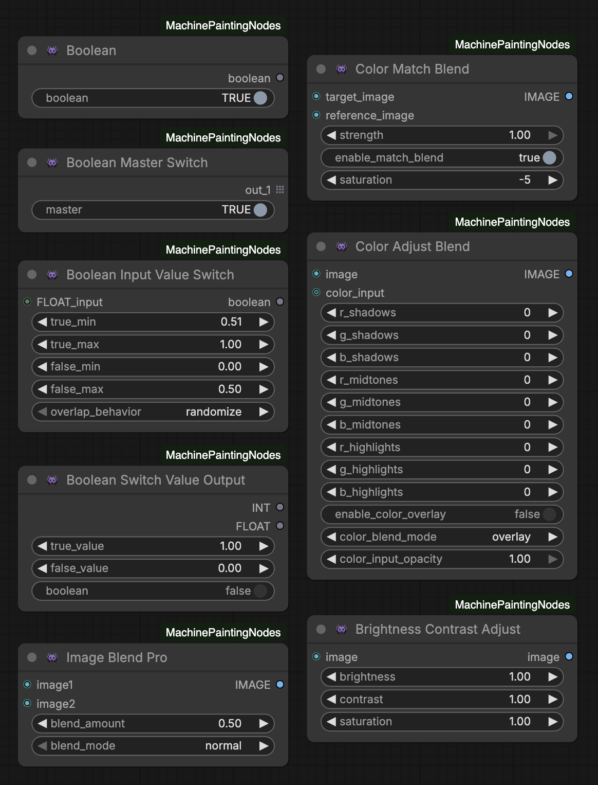

# MachinePaintingNodes for ComfyUI - By MachinePainting

**Professional color, blending, and utility tools for AI artists.**

A growing collection of high-quality custom nodes focused on precise color correction, advanced image blending, boolean/conditional logic, and workflow utilities.

Perfect for ComfyUI users who want Photoshop-like control in their AI painting pipelines.

## Features & Nodes

### Color & Blending Tools
- **ColorAdjustBlend**  
  Per-channel tonal adjustments (shadows, midtones, highlights) + blend modes with optional color overlay.

- **ColorMatchBlend**  
  Match hue, saturation, and overall color from a reference image to your target.

- **ImageBlendPro**  
  Advanced layer blending with 15+ Photoshop-style modes (normal, multiply, screen, overlay, soft_light, color, luminosity, etc.).

### Utility & Control Nodes
- **Boolean Master Switch**  
  Central boolean toggle to enable/disable entire branches or groups of nodes.

- **Boolean Input Value Switch**  
  Switch between two input values (e.g., numbers, strings, images) based on a boolean condition.

- **Boolean Switch Value Output**  
  Output different values depending on boolean state (great for dynamic parameters).

- **Seed Boolean Lock**  
  Locks the current generation's seed (opposed to locking for the next run) when boolean is true.

- **Brightness Contrast Adjust**
  Simple, precise control over brightness and contrast — useful as a quick post-process or in masked areas.

(Additional boolean utilities may be added soon — stay tuned!)

## Node Details

### ColorAdjustBlend
Fine-tune **shadows, midtones, highlights** per RGB channel.

| Parameter              | Range          | Effect                          |
|------------------------|----------------|---------------------------------|
| r/g/b_shadows          | -100 to +100   | Lift dark areas                 |
| r/g/b_midtones         | -100 to +100   | Balance middle tones            |
| r/g/b_highlights       | -100 to +100   | Control bright areas            |

**Optional Overlay:**  
- enable_color_overlay  
- color_input (image)  
- color_blend_mode (overlay, multiply, screen, etc.)  
- color_input_opacity (0.0–1.0)

### ColorMatchBlend
Match **hue & saturation** from a reference.

| Parameter       | Range       | Effect                     |
|-----------------|-------------|----------------------------|
| target_image    | —           | Image to adjust            |
| reference_image | —           | Color source               |
| strength        | 0.0–1.0     | Blend intensity            |
| saturation      | -100 to +100| Boost/reduce vibrance      |

### ImageBlendPro
Blend two images with **Photoshop-grade modes**.

| Blend Mode     | Effect                  |
|----------------|-------------------------|
| normal         | Standard overlay        |
| multiply       | Darken                  |
| screen         | Lighten                 |
| overlay        | Contrast boost          |
| soft_light     | Gentle contrast         |
| color          | Hue + saturation only   |
| luminosity     | Brightness only         |

`blend_amount`: 0.0 (image1) → 1.0 (image2)

### Boolean & Utility Nodes (New Additions)
These help create cleaner, more conditional workflows without spaghetti.

- **Boolean Master Switch**: One boolean to rule them all — bypass or activate whole sections.
- **Boolean Input Value Switch**: Choose value A or B based on condition.
- **Boolean Switch Value Output**: Similar but for outputs.
- **Seed Boolean Lock**: Freeze seed on true — prevents random changes mid-workflow.
- **Brightness Contrast Adjust**: Classic brightness/contrast sliders.

## Installation

1. In ComfyUI Manager: Search for "MachinePaintingNodes" (or add custom repo if not listed yet).
2. Or manual:

`cd ComfyUI/custom_nodes`
`git clone https://github.com/machinepainting/ComfyUI-MachinePaintingNodes.git`

3. Restart ComfyUI (or click "Restart" in Manager).
4. Nodes appear under **MachinePainting** or **utils** categories.

No extra models required — pure Python nodes.

## Usage Tips
- Chain **ColorMatchBlend** → **ColorAdjustBlend** → **ImageBlendPro** for pro-level color grading.
- Use boolean switches to A/B test styles without duplicating workflows.
- Lock seeds during refinement to keep variations controlled.

👾 Made by MachinePainting for the ComfyUI community.  
Feedback/PRs welcome — drop an issue or star if ya dig!
