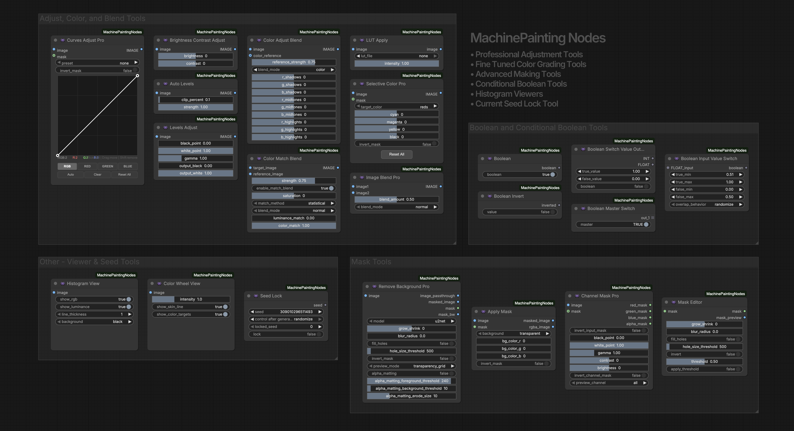
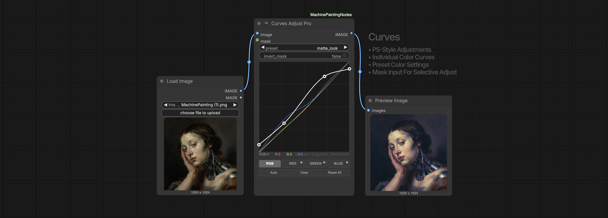
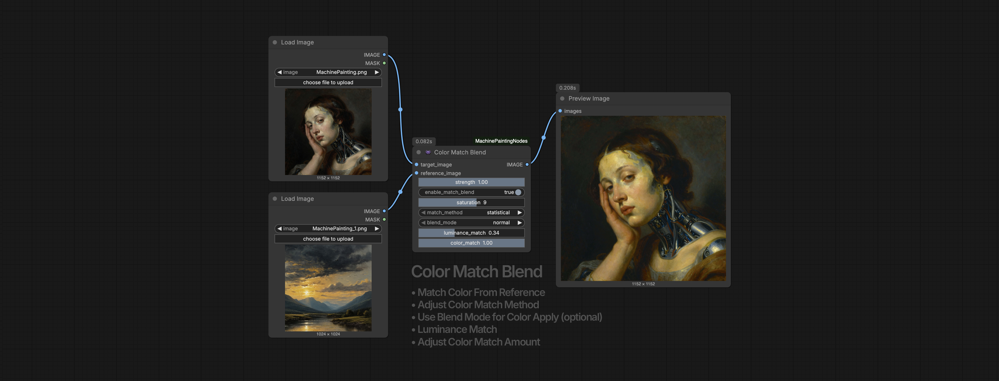
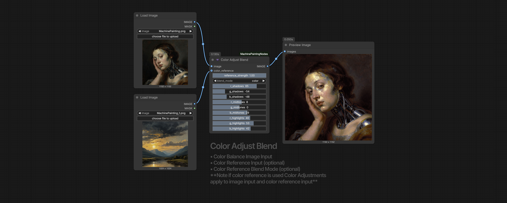
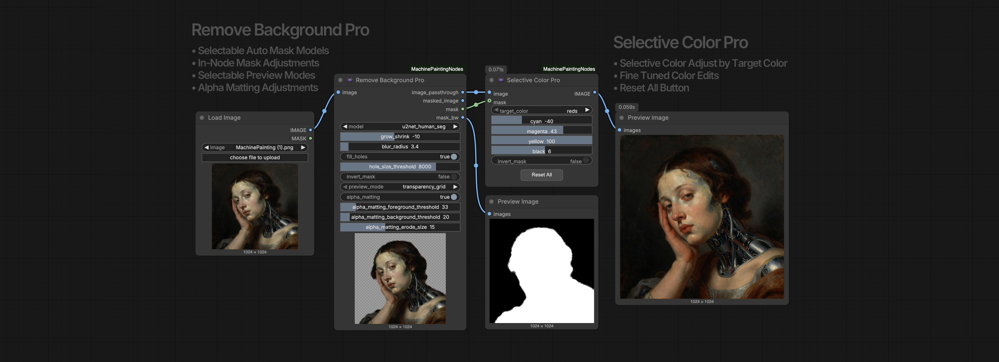
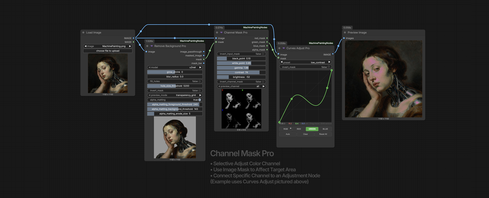
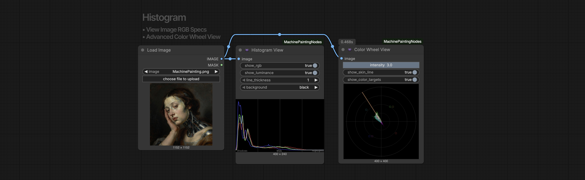
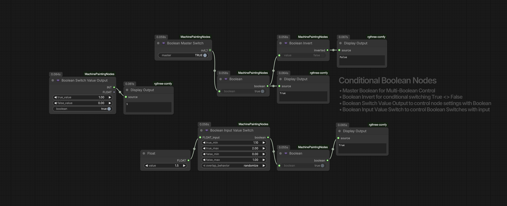

# ComfyUI-MachinePaintingNodes

**Professional Image Editing & Adjustments, Curves, color grading, mask tools, filters, and advanced utilities for your ComfyUI workflows**

A comprehensive node suite for professional level image processing, color correction, frequency separation, film grain, blur tools, inpainting mask management, and advanced workflow enhancement utilities.

---

### New Nodes

| Node | Category | Date Added |
|------|----------|------------|
| **Blur Pro** | Filters | 2026-03-27 |
| **Noise Grain Pro** | Filters | 2026-03-27 |
| **Frequency Separate** | Filters | 2026-03-27 |
| **Frequency Combine** | Filters | 2026-03-27 |
| **Inpaint Mask Pro** | Mask | 2026-03-27 |
| **Mask Composite Pro 2X** | Mask | 2026-03-28 |
| **Mask Composite Pro 6X** | Mask | 2026-03-28 |
| **Image <> Mask Switch** | Utilities | 2026-03-27 |
| **Image Transform Pro** | Transform | 2026-09-03 |

---

(All current nodes.)


## Installation

### ComfyUI Manager (Recommended)
Search for "MachinePaintingNodes" in ComfyUI Manager and install.

### Manual Installation
```bash
cd ComfyUI/custom_nodes
git clone https://github.com/machinepainting/ComfyUI-MachinePaintingNodes.git
```

### Dependencies
```bash
pip install -r requirements.txt
```

---

## Nodes (41 Total)

### Color Adjustment

(example)


| Node | Description |
|------|-------------|
| **Curves Adjust Pro** | Interactive Photoshop-style curves with RGB/R/G/B channels, 17 presets, mask support, channel-mask support |
| **Levels Adjust** | Black point, white point, gamma, output levels |
| **Auto Levels** | Automatic levels correction |
| **Selective Color Pro** | CMYK adjustments for specific color ranges and fine tuned color adjustments (reds, yellows, greens, cyans, blues, magentas, whites, neutrals, blacks) |
| **Brightness Contrast Adjust** | Simple brightness and contrast controls with simple slider controls |
| **Color Match Blend** | Match colors from one image to another with multiple methods (statistical, histogram, reinhard), blend modes, and adjustments |
| **Color Adjust Blend** | Color match with blend modes, plus RGB color balance for Shadows, Mid-Range, and Highlights |
| **LUT Apply** | Apply .cube/.3dl LUT files for cinematic color grading (includes 5 bundled LUTs) |

(examples)



### Filters

| Node | Description |
|------|-------------|
| **Blur Pro** | Professional multi-type blur with 5 modes: Gaussian, Surface (bilateral/edge-preserving), Box, Median, and Motion blur. Per-type dynamic sliders, mask-controlled application, strength blending, optional mask blurring, in-node preview. Large radius optimization for fast processing at high values. |
| **Noise Grain Pro** | Realistic film grain/noise generator with grain size, sharpness, color/mono toggle, saturation control, seed for reproducibility. 6 blend modes: overlay, soft light, hard light, linear light, multiply, screen. Mask support and in-node preview. |
| **Frequency Separate** | Splits an image into high frequency (texture/detail) and low frequency (color/tone) layers using the exact Photoshop Apply Image formula (Scale 2, Offset 128, Subtract). Original image pass-through output for easy chaining. |
| **Frequency Combine** | Recombines high and low frequency layers using Linear Light blend with opacity control. |

### Mask and Background

| Node | Description |
|------|-------------|
| **Remove Background Pro** | Advanced AI-powered background removal with 8 rembg models, mask editing tools, multiple preview modes, and optional rotation / zoom / XY placement applied to every output |
| **Mask Editor** | Stand alone Mask Tools. Refine masks with grow/shrink/blur/fill |
| **Apply Mask** | Composite image with mask and background options |
| **Channel Mask Pro** | Extract R/G/B/A channels as separate masks with levels/contrast adjustments and input mask support for advanced Channel Masking |
| **Inpaint Mask Pro** | Advanced inpaint mask management node. Combines an inpaint mask with an optional silhouette mask to crop sloppy inpaint regions to clean boundaries. Features: invert toggle, expand/shrink, per-mask blur, mask expand/contract, multi-color overlay preview with independent color and opacity per layer. Outputs: image pass-through, processed mask, B&W mask image, and preview image. |
| **Mask Composite Pro 2X** | Combine 2 masks with per-mask blur, grow/shrink, and opacity. Screen blend for natural mask union. Output selector and invert toggle. |
| **Mask Composite Pro 6X** | Combine up to 6 masks with per-mask blur, grow/shrink, and opacity. Screen blend for natural mask union. Output selector (all or individual 1-6) and invert toggle. |

(examples)



### Blending

| Node | Description |
|------|-------------|
| **Image Blend Pro** | Blend images with 15 blend modes (normal, overlay, multiply, screen, soft light, hard light, etc.) |

### Transform

| Node | Description |
|------|-------------|
| **Image Transform Pro** | Rotate, scale and reposition an image inside a definable canvas. Free rotation or fixed 45 degree snapping, centre-zero zoom slider, XY placement, and an optional mask input that rides the same transform and cuts the image out over the selected background. |

### Analysis

| Node | Description |
|------|-------------|
| **Histogram View** | Display RGB/luminance histogram in-node for advanced image setting color display |
| **Color Wheel View** | Display vectorscope color distribution in-node for advanced image setting color display |

(example)


### Utilities

| Node | Description |
|------|-------------|
| **Image <> Mask Switch** | Convert between IMAGE and MASK types with a toggle. Image-to-mask converts to grayscale using Rec. 601 luma. Mask-to-image expands to 3-channel RGB. |
| **Boolean** | Output a true/false value |
| **Boolean Invert** | Flip boolean value (true to false, false to true) for advanced workflow pipeline and settings switching |
| **Boolean Switch Value Output** | Output different values based on boolean for advanced workflow pipeline and settings switching |
| **Boolean Input Value Switch** | Route inputs based on boolean for advanced workflow pipeline and settings switching |
| **Boolean Master Switch** | Control multiple booleans from one switch for controlling multiple switches with one master switch node |
| **Seed Lock** | Lock/unlock seed values with a toggle to lock the current seed value, opposed to the standard where the following run seed value is locked |
| **Text Notes** | Add comments and documentation to your workflow for organization |
| **Text String** | Simple text input node for passing strings to other nodes |
| **Show Text** | Display and pass through text output from other nodes for debugging |
| **Show Value** | Display any value type (float, int, string, bool) in the node for debugging |
| **Mega Slider Master Value** | Master settings (min/max/step) for connected Mega Sliders |
| **Mega Slider X1** | Single universal slider with optional master input and per-slider property overrides |
| **Mega Slider X3** | 3 universal sliders with optional master input and per-slider property overrides |
| **Mega Slider X6** | 6 universal sliders with optional master input and per-slider property overrides |
| **Mega Slider X12** | 12 universal sliders with optional master input and per-slider property overrides |
| **Dynamic Value Range** | Automatically cycles through a value range on each run (increment/decrement/random) |
| **Z-Image Empty Latent Image** | Empty latent image with Z-Image optimized resolutions from 512x512 to 2048x2048 (landscape, portrait, square) |

(example)


---

## Features

### Blur Pro
- 5 blur types in one node with dynamic slider UI that shows only relevant controls per type
- **Gaussian** — General-purpose smoothing (radius)
- **Surface Blur** — Edge-preserving bilateral filter for retouching (radius + threshold). Smooths skin/textures while keeping edges sharp.
- **Box Blur** — Fast uniform blur (radius)
- **Median** — Edge-preserving noise removal, kills salt-and-pepper artifacts (radius)
- **Motion Blur** — Directional blur for movement effects (angle + radius)
- Large radius optimization: radii above 30 auto-downscale for fast processing
- Mask input controls where blur is applied, optional mask blurring toggle
- Strength slider to blend blurred result with original
- In-node preview

### Noise Grain Pro
- Realistic film grain with independent controls for size, sharpness, and color
- **Grain size** (0.5-10) — Controls particle size by generating noise at reduced resolution
- **Sharpness** (0-1) — Grain definition from soft/diffused to crisp
- **Monochromatic** toggle — Mono grain vs color grain
- **Saturation** — Color intensity for color grain mode
- 6 industry-standard blend modes: overlay, soft light, hard light, linear light, multiply, screen
- Soft Light uses the correct W3C/Photoshop formula
- Seed input for reproducible grain
- Mask support for selective application
- In-node preview

### Frequency Separation
- Professional retouching workflow: split image into texture and color/tone layers
- **Frequency Separate** — Takes original image + a blurred version (from Blur Pro or any blur node), outputs high frequency (neutral gray texture), low frequency (pass-through), and original (pass-through)
- Uses the exact Photoshop Apply Image formula: Scale 2, Offset 128, Subtract
- **Frequency Combine** — Recombines layers using Linear Light blend with opacity slider
- Opacity controls texture strength: 0 = smooth only, 1 = full reconstruction
- Filter-agnostic: use any blur node upstream (Gaussian for standard, Surface Blur for edge-aware retouching)

### Inpaint Mask Pro
- Solves the problem of applying external inpaint masks when the Load Image node doesn't accept mask inputs
- Combines an inpaint mask with a clean silhouette mask to crop sloppy inpaint regions
- **Invert toggle** for flipping the inpaint mask
- **Expand/shrink slider** for growing or shrinking the inpaint mask
- **Inpaint blur** for softening inpaint mask edges
- **Mask crop** (advanced) with blur and expand/contract controls for the silhouette mask
- **Multi-color overlay preview** with independent toggle, color, and opacity per layer:
  - Inpaint mask: red, light blue, black, white
  - Crop mask: lime green, purple, black, white
- Outputs: image pass-through, processed mask, B&W mask image, colored preview image

### Mask Composite Pro 2X / 6X
- Combine 2 or 6 masks into one unified mask
- Per-mask controls: **blur**, **grow/shrink**, **opacity**
- **Screen blend mode** for combining — creates natural mask unions where overlapping areas blend smoothly
- **Output selector** — output all masks combined, or select an individual mask for isolation
- **Invert output** toggle to flip the final result
- Handles mismatched mask sizes automatically (resizes to match mask_1)
- 2X variant for simple two-mask workflows, 6X for complex compositing

### Image <> Mask Switch
- Toggle between image-to-mask and mask-to-image conversion
- Image-to-mask: converts RGB to grayscale using Rec. 601 luma coefficients (0.299R + 0.587G + 0.114B)
- Mask-to-image: expands single-channel mask to 3-channel RGB
- Both outputs always populated for stable downstream connections

### Image Transform Pro
- **Canvas W/H** inputs (0 = match the incoming image) define the frame the image rotates inside
- **Free** rotation, or **fixed** snapping to 45 degree increments
- Angle slider centred on 0: counter-clockwise to the left, clockwise to the right
- **Zoom** slider centred on 0 (1.0x), exponential: -100 = 0.25x, -50 = 0.5x, +50 = 2x, +100 = 4x
- **XY placement** sliders as a percent of canvas, so they keep working when the canvas or source size changes
- Source is fitted inside the canvas first, then zoom is applied, so zoom 0 always shows the whole image
- Optional **mask input** is transformed by the identical matrix, stays registered to the image, and cuts the image out: whatever the mask leaves out is filled with the selected background
- Background select: transparent, black or white. With no mask supplied, the transformed image extent becomes the mask
- Lanczos resampling, in-node preview with a transparency grid

### Curves Adjust Pro
- Interactive curve editor with click-to-add, drag-to-move, shift-click-to-remove points
- Separate RGB, Red, Green, Blue channel curve editing
- 17 built-in presets (S-Curve Contrast, Fade, Cross Process, Cinematic, etc.)
- Visual display of all channel curves in RGB mode
- Mask support with invert option
- Spline interpolation for smooth curves

### Color Match Blend
- 3 matching methods: statistical, histogram, reinhard
- 10 blend modes: normal, overlay, multiply, screen, soft light, hard light, color, luminosity, darken, lighten
- Separate luminance and color match controls
- Saturation adjustment

### Color Adjust Blend
- Optional color reference input with LAB color matching
- Blend modes for color application
- RGB color balance with shadow/midtone/highlight zones
- Works standalone as simple color balance without reference

### LUT Apply
- Supports .cube and .3dl LUT formats
- 5 bundled LUTs included (auto-installed to `ComfyUI/input/luts/`):
  - Cinematic_Teal_Orange
  - Warm_Tone
  - Cool_Tone
  - Vintage_Fade
  - High_Contrast
- Intensity slider to blend effect
- Add your own LUTs to `ComfyUI/input/luts/`

### Remove Background Pro
- 8 AI models: u2net, u2netp, u2net_human_seg, u2net_cloth_seg, silueta, isnet-general-use, isnet-anime, sam
- Built-in mask refinement (grow/shrink, blur, threshold)
- Preview modes: masked, mask only, side-by-side, overlay
- Edge feathering for smooth composites
- **Rotation** toggle with free or fixed (45 degree snap) methods, centre-zero angle slider (CCW left, CW right), centre-zero zoom slider and XY placement sliders
- Zoom matches the Image Transform Pro node (-100 = 0.25x, -50 = 0.5x, +50 = 2x, +100 = 4x). The canvas never grows, so zooming in crops and zooming out leaves empty edges
- Rotation runs *after* removal, so rembg always segments the upright image, and image, mask and masked outputs all ride the same transform

### Channel Mask Pro
- Separates image into R, G, B, Alpha channel masks
- Levels adjustments (black point, white point, gamma)
- Contrast and brightness controls
- Input mask support with invert option
- B&W preview with R/G/B/L labels

### Selective Color Pro
- Target specific colors: reds, yellows, greens, cyans, blues, magentas, whites, neutrals, blacks
- CMYK adjustment sliders (-100 to +100)
- Smooth RGB-based color detection for natural results
- Reset All button
- Mask support

### Text Notes
- Multiline text area for workflow documentation
- Optional title field
- No inputs/outputs - purely organizational

### Text String
- Simple text input with multiline support
- Outputs STRING for connecting to other nodes

### Show Text
- Display text output from other nodes
- Pass-through output for chaining

### Show Value
- Display any value type (float, int, string, bool) in the node
- Accepts any input type for universal debugging

### Mega Slider Master Value
- Set min/max/step values in one place
- Connect to any Mega Slider node to control all its sliders
- One master can connect to multiple slider nodes
- Slider UI updates in real-time when master values change

### Mega Slider X1 / X3 / X6 / X12
- 1, 3, 6, or 12 universal sliders with individual outputs
- Optional **master** input: connect Mega Slider Master Value to apply min/max/step to all sliders
- **Per-slider overrides:** Right-click node → Properties to set individual `slider_N_min`, `slider_N_max`, `slider_N_step`
- Output as float or integer (toggle)
- Sliders snap to step increments when properties are set

### Dynamic Value Range
- Automatically cycles through a range of values on each workflow run
- Modes: increment, decrement, random
- On cycle complete: reverse direction or jump to other end
- Outputs: FLOAT, INT, and STRING versions
- Perfect for creating diversity across batch generations

### Z-Image Empty Latent Image
- Pre-configured resolutions optimized for Z-Image model
- Landscape, portrait, and square options from 512x512 to 2048x2048
- Outputs LATENT, WIDTH, and HEIGHT for flexible workflow connections
- Configurable batch size

---

## Changelog

### v2.2.0
- **New Node:** Image Transform Pro - rotate, scale and reposition an image inside a definable canvas, with an optional mask input that rides the same transform and cuts the image out over the selected background. Free or fixed (45 degree snap) rotation, centre-zero angle and zoom sliders, percent-based XY placement, and transparent/black/white background fill
- **Remove Background Pro:** added a rotation block at the bottom of the settings (enable toggle, free/fixed method, angle slider, centre-zero zoom slider, XY placement). Applied after removal so segmentation always runs on the upright image, and the canvas stays at the original size
- **New:** shared `transform_utils` module so both nodes use identical rotate/zoom/offset math

### v2.1.4
- **Fix:** Cleared registry Icon metadata (the field expects an image URL, not an emoji) so the broken-image avatar on registry.comfy.org goes away

### v2.1.3
- **Fix:** Aligned `pyproject.toml` and `requirements.txt` to use `opencv-python-headless` (resolves install conflicts on headless servers)
- **Fix:** Replaced deprecated `Image.LANCZOS` with `Image.Resampling.LANCZOS` for Pillow 11+ compatibility
- **Fix:** Pinned `numpy<3` to avoid breakage when NumPy 3 ships
- **Update:** Standardized JS frontend imports to absolute `/scripts/app.js` paths for forward compatibility
- **Update:** Added 👾 emoji icon to registry metadata

### v2.1.2
- **Fix:** Frequency Separate — locked to correct Photoshop formula (Scale 2, Offset 128, Subtract), removed mode/epsilon options
- **Fix:** Frequency Combine — locked to Linear Light blend, added opacity slider, removed mode/epsilon options
- **Update:** Blur Pro — removed distance and iterations parameters, motion blur uses radius, box blur single pass
- **Update:** Inpaint Mask Pro — removed SEGS support (simplified), inpaint_mask now required

### v2.1.1
- **New Node:** Mask Composite Pro 2X — combine 2 masks with per-mask blur, grow/shrink, opacity, screen blend, output selector, invert toggle
- **New Node:** Mask Composite Pro 6X — combine up to 6 masks with same features
- **Update:** Inpaint Mask Pro — added inpaint expand/shrink slider, multi-color overlay with per-layer display settings, removed SEGS (simplified to image + mask inputs)
- **Update:** Blur Pro — type-specific sliders marked as advanced for cleaner default view

### v2.1.0
- **New Node:** Blur Pro — 5 blur types (Gaussian, Surface, Box, Median, Motion) with dynamic UI, mask support, strength blending, large radius optimization, in-node preview
- **New Node:** Noise Grain Pro — Film grain generator with size, sharpness, color/mono, saturation, 6 blend modes, seed, mask support
- **New Node:** Frequency Separate — Split image into high/low frequency layers for professional retouching
- **New Node:** Frequency Combine — Recombine frequency layers with Linear Light blend
- **New Node:** Inpaint Mask Pro — Advanced inpaint mask management with mask cropping, multi-color overlay preview
- **New Node:** Image <> Mask Switch — Toggle conversion between IMAGE and MASK types
- **New Category:** Filters (Blur Pro, Noise Grain Pro, Frequency Separate/Combine)

### v2.0.5
- **Fix:** Updated pyproject.toml version to match release
- **Fix:** Corrected node count

### v2.0.4
- **New Node:** Z-Image Empty Latent Image with optimized resolutions for Z-Image model

### v2.0.3
- **New Nodes:** Show Value, Mega Slider Master Value, Mega Slider X1/X3/X6/X12, Dynamic Value Range
- **Mega Slider Master Value:** Set min/max/step for connected Mega Sliders
- **Mega Sliders:** Universal slider banks with optional master input and per-slider settings via right-click → Properties
- **Dynamic Value Range:** Auto-cycling values for batch diversity (increment/decrement/random modes)
- **Show Value:** Display any value type in-node for debugging

### v2.0.2
- **New Nodes:** Text Notes, Text String, Show Text utility nodes
- **Organized Categories:** Nodes now grouped into subcategories (Color, Mask, Blend, Analysis, Util)

### v2.0.1
Updated Node Settings, Resolved Display Issues, Fixed Several Node structures.

### v2.0.0
Major Overhaul, Node Additions, and Improvements

- **New Nodes:** LUT Apply, Channel Mask Pro, Selective Color Pro, Boolean Invert
- **Bundled LUTs:** 5 color grading LUTs included with auto-install
- **Curves Adjust Pro:** Added mask support, improved curve display showing all channels in RGB mode
- **Channel Mask Pro:** Added input mask support, levels/contrast adjustments, improved B&W preview
- **Unified Category:** All nodes now appear under single "MachinePaintingNodes" folder
- **Selective Color Pro:** Added Reset All button
- **Analysis Nodes:** Improved auto-scaling for Histogram and Color Wheel views
- **Code Cleanup:** Removed deprecated nodes, standardized categories

### v1.0.0
- Initial release with color adjustment, blending, and boolean utility nodes

---

## License

MIT License - See [LICENSE](LICENSE) for details.

---

## Want to Auto Send your ComfyUI files from output folder to your Google Drive or Dropbox Account?

Check out these new Nodes to advance your Ai workflows. Super helpful tools to protect your creations and streamline your process. DriveSend and DropSend node with optional file Encryption.

- [ComfyUI_DriveSendNode](https://github.com/machinepainting/ComfyUI_DriveSendNode)
- [ComfyUI_DropSendNode](https://github.com/machinepainting/ComfyUI_DropSendNode)

---

## Tags

`comfyui` `comfyui-nodes` `custom-nodes` `color-grading` `color-correction` `curves` `levels` `lut` `lookup-table` `photoshop` `image-processing` `image-editing` `background-removal` `rembg` `masking` `mask-editor` `channel-mixer` `histogram` `vectorscope` `blend-modes` `compositing` `stable-diffusion` `ai-art` `generative-art` `film-emulation` `cinematic` `color-matching` `hsl` `cmyk` `selective-color` `boolean-logic` `workflow` `utilities` `sliders` `dynamic-values` `blur` `gaussian-blur` `surface-blur` `motion-blur` `bilateral-filter` `film-grain` `noise` `frequency-separation` `retouching` `inpainting` `segs`
